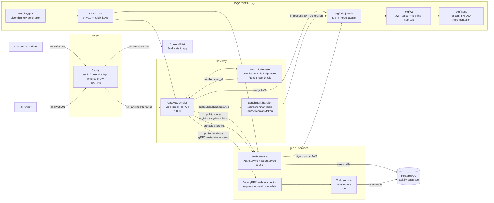
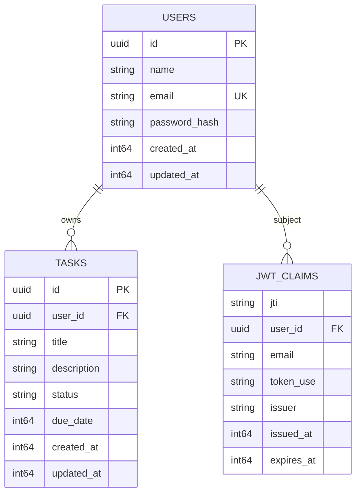
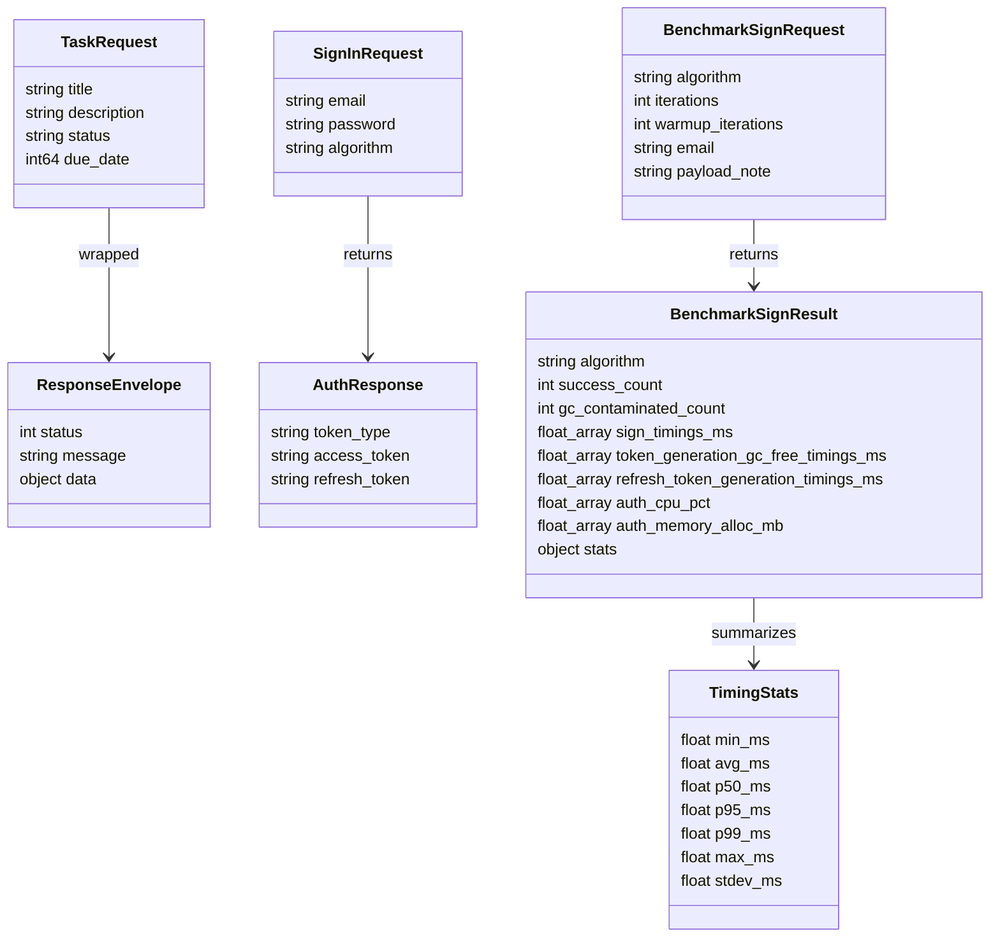
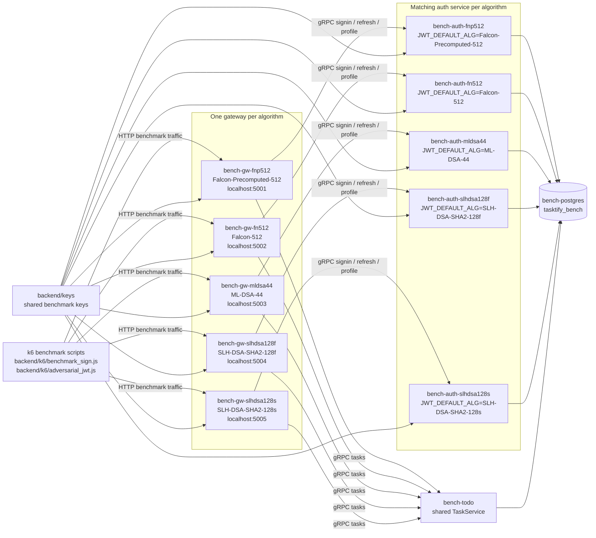
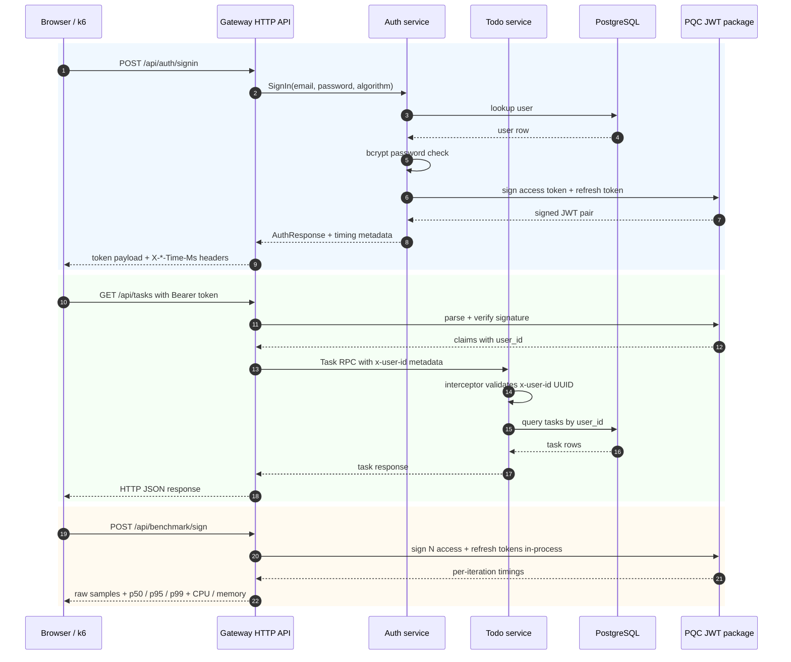
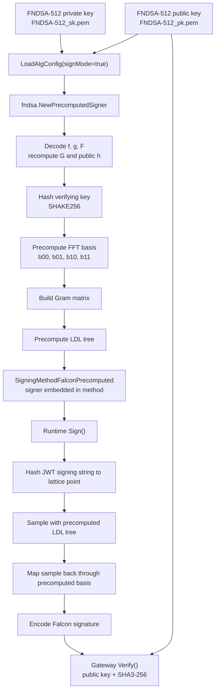
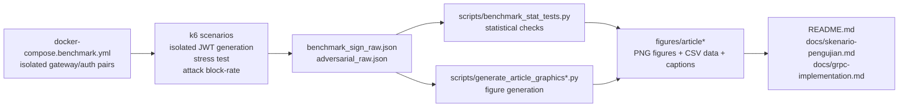

# Research System Architecture

Mermaid diagrams for Tasktify research architecture. Scope: production runtime, benchmark topology, request flows, and research artifact pipeline.

## Paper-Style System Architecture

```mermaid
flowchart LR
  %% Section order follows paper flow: input -> service/data -> JWT -> optimization -> evaluation.

  subgraph sec31["SECTION 3.1<br/>API ENTRY"]
    direction TB
    client["Browser / k6"]
    caddy["Caddy<br/>Static + API proxy"]
    gateway["Gateway<br/>HTTP to gRPC"]
    client --> caddy
    caddy --> gateway
  end

  subgraph sec32["SECTION 3.2<br/>SERVICE + DATA"]
    direction TB
    route_type{"Route type"}
    auth_svc["Auth service<br/>register, signin,<br/>refresh, profile"]
    todo_svc["Todo service<br/>task CRUD"]
    users_db[("users<br/>id, email,<br/>password_hash")]
    tasks_db[("tasks<br/>id, user_id,<br/>status, due_date")]

    route_type -->|"auth / profile"| auth_svc
    route_type -->|"tasks + x-user-id"| todo_svc
    auth_svc --> users_db
    todo_svc --> tasks_db
  end

  subgraph sec33["SECTION 3.3<br/>PQC JWT"]
    direction TB
    claims["JWT claims<br/>jti, user_id, email,<br/>token_use, iss, iat, exp"]
    alg_policy["Alg policy<br/>default + allowlist"]
    signer["PQC signer<br/>Falcon, ML-DSA, SLH-DSA"]
    token_pair["Token pair<br/>access + refresh"]
    verifier["Verifier<br/>alg, issuer, exp,<br/>signature, token_use"]

    claims --> alg_policy
    alg_policy --> signer
    signer --> token_pair
    token_pair --> verifier
  end

  subgraph sec34["SECTION 3.4<br/>OPTIMIZED METHOD"]
    direction TB
    key_load["Load FNDSA-512 keys"]
    precompute["Startup precompute<br/>decode f,g,F<br/>derive G,h"]
    cache["Cache<br/>hashedVK, FFT basis,<br/>LDL tree"]
    runtime_sign["Runtime sign<br/>reuse cache"]
    signature["Falcon signature"]

    key_load --> precompute
    precompute --> cache
    cache --> runtime_sign
    runtime_sign --> signature
  end

  subgraph sec35["SECTION 3.5<br/>EVALUATION"]
    direction TB
    bench_api["Benchmark API<br/>sign + token"]
    k6_phases["k6 phases<br/>isolated, stress,<br/>attack block-rate"]
    metrics["Metrics<br/>raw, GC-free,<br/>CPU/mem, p95"]
    artifacts["Artifacts<br/>JSON, tests,<br/>figures, docs"]

    bench_api --> k6_phases
    k6_phases --> metrics
    metrics --> artifacts
  end

  gateway --> route_type
  gateway --> bench_api
  auth_svc -->|"signin / refresh"| claims
  signer -->|"Falcon-Precomputed-512"| key_load
  signer -->|"JWT generation endpoint"| bench_api
  signer -->|"latency samples"| metrics

  classDef entry fill:#dbeafe,stroke:#2563eb,color:#111827
  classDef service fill:#dcfce7,stroke:#16a34a,color:#111827
  classDef data fill:#fef9c3,stroke:#ca8a04,color:#111827
  classDef crypto fill:#ede9fe,stroke:#7c3aed,color:#111827
  classDef opt fill:#ffedd5,stroke:#ea580c,color:#111827
  classDef output fill:#e0f2fe,stroke:#0284c7,color:#111827

  class client,caddy,gateway entry
  class route_type,auth_svc,todo_svc service
  class users_db,tasks_db,claims,metrics data
  class alg_policy,signer,token_pair,verifier crypto
  class key_load,precompute,cache,runtime_sign,signature opt
  class bench_api,k6_phases,artifacts output

  style sec31 fill:#f8fafc,stroke:#64748b,stroke-dasharray: 5 5
  style sec32 fill:#f8fafc,stroke:#64748b,stroke-dasharray: 5 5
  style sec33 fill:#f8fafc,stroke:#64748b,stroke-dasharray: 5 5
  style sec34 fill:#f8fafc,stroke:#64748b,stroke-dasharray: 5 5
  style sec35 fill:#f8fafc,stroke:#64748b,stroke-dasharray: 5 5
```

Diagram reading:

- 3.1: request masuk lewat Caddy, lalu Gateway.
- 3.2: Gateway dispatch ke Auth/Todo; data inti ada di `users` dan `tasks`.
- 3.3: Auth/benchmark membentuk JWT, signer PQC menandatangani, Gateway memverifikasi.
- 3.4: Falcon-Precomputed memindahkan decode, FFT basis, dan LDL tree ke startup cache.
- 3.5: k6 mengukur generasi JWT, stress, attack block-rate; output jadi JSON, statistik, figure, docs.

## Production Runtime

## Data Structure

Data structure rules:

- Persistent data split by owner: Auth service owns `users`; Todo service owns `tasks`.
- `users.email` is unique. Password stored as bcrypt hash, never plaintext.
- `tasks.user_id` links task rows to authenticated user. API and repository scope task reads/writes by that user.
- JWT payload carries `sub`, `user_id`, `email`, `token_use`, `iss`, `iat`, `exp`, and `jti`.
- Token header carries `alg` and `typ`; gateway parser accepts only configured algorithms and validates token type against `token_use`.
- `Falcon-Precomputed-512` is a signer profile. JWT header `alg` remains `FN-DSA-512` for both dynamic and precomputed Falcon profiles.
- gRPC contracts use protobuf messages. HTTP handlers map JSON DTOs to protobuf requests.
- Benchmark output keeps raw samples plus summary stats so research can audit p50/p95/p99 and GC-free timing.

## Benchmark Topology

## Request Flows

## Optimized Method Used

Optimization logic:

- Baseline `Falcon-512` signs with `fndsa.Sign`, which decodes private key and recomputes key-dependent lattice data during signing.
- Optimized `Falcon-Precomputed-512` builds `PrecomputedSigner` once at service startup.
- Startup precompute stores `hashedVK`, FFT basis arrays `b00`, `b01`, `b10`, `b11`, and LDL tree.
- Runtime signing reuses stored basis and LDL tree, so each JWT sign avoids repeated private-key decode, `G` recomputation, FFT basis generation, Gram matrix construction, and LDL tree construction.
- Verification unchanged at cryptographic level: gateway verifies `FN-DSA-512` signature with public key, algorithm allowlist, `typ`, issuer, subject, token_use, issued-at, and expiry checks.
- Benchmark measures effect through `/api/benchmark/sign`: warmup, forced GC, per-iteration access/refresh JWT generation, GC-contaminated count, CPU, memory, and timing stats.

## Research Artifact Pipeline

